

  

 

## 📌 About

I'm a Software Engineer focused on building high-performance systems where architectural integrity meets seamless user experience. I design and deploy stable full-stack web applications and interactive client interfaces, specializing in functional **MERN stack** workflows, asynchronous data communication, and clean application architecture.

From modeling well-structured database objects and managing REST API paths to setting up dynamic frontend states, I enjoy shipping complete web platforms that are reliable and easy to use — backed by production-ready components, robust data workflows, and stable application pathways.

- 🧠 **AI/ML Expertise** — integrating Generative AI (Gemini API) into resume-parsing pipelines, evaluation engines, and context-aware tools
- 🏗️ **Full-Stack Development** — MongoDB, Express, React, Node.js applications with optimized schemas and state-driven UI
- ⚙️ **Product Engineering Mindset** — practical evaluation tools, structured data mapping, and reliable API-driven architecture

**🎯 Open To:** Software Engineering internships & full-time roles, open-source collaboration, and applied AI/full-stack projects.

 

## 🛠️ Tech Stack

  

 

## 🚀 Featured Projects

<!--PROJECTS:START-->

<a href="https://github.com/KedarGhadyalji/tailwind-warning-auto-fix"><picture><source media="(prefers-color-scheme: dark)" srcset="profile/project-1-dark.svg"/></picture></a>
<a href="https://github.com/KedarGhadyalji/Spawn_Git_Clone"><picture><source media="(prefers-color-scheme: dark)" srcset="profile/project-2-dark.svg"/></picture></a>
<a href="https://github.com/KedarGhadyalji/PixelJar"><picture><source media="(prefers-color-scheme: dark)" srcset="profile/project-3-dark.svg"/></picture></a>
<a href="https://github.com/KedarGhadyalji/CraftedCV"><picture><source media="(prefers-color-scheme: dark)" srcset="profile/project-4-dark.svg"/></picture></a>
<a href="https://github.com/KedarGhadyalji/AnalyzedCV"><picture><source media="(prefers-color-scheme: dark)" srcset="profile/project-5-dark.svg"/></picture></a>
<a href="https://github.com/KedarGhadyalji/genie-ai-pocket-agent"><picture><source media="(prefers-color-scheme: dark)" srcset="profile/project-6-dark.svg"/></picture></a>

<!--PROJECTS:END-->

<!-- Click a card to open the repository. Cards update from `data/projects.json`. -->

 

## 💼 Experience

### Research and Innovation Intern, Software Development · Cyber Secured India
`Jan 2026 - Apr 2026`

Engineered core system mechanics, interactive modules, and progress-tracking layouts for a centralized Learning Management System (LMS).

- Implemented secure dual-mode authentication, dynamic evaluation tools, discussion forums, and automated certificate generation
- Optimized front-facing delivery channels, improving mobile responsiveness, layout performance, and UI stability

   

 

## 📊 GitHub Analytics


  


 

## 📈 Contribution Activity


 

## 🐍 Contribution Snake

<picture>
  <source media="(prefers-color-scheme: dark)" srcset="https://raw.githubusercontent.com/KedarGhadyalji/KedarGhadyalji/output/github-contribution-grid-snake-dark.svg" />
  <source media="(prefers-color-scheme: light)" srcset="https://raw.githubusercontent.com/KedarGhadyalji/KedarGhadyalji/output/github-contribution-grid-snake.svg" />
  
</picture>

 

## 📬 Connect

 

---

*"Turning complex problems into elegant, functional reality."*

<!--
# 💫 About Me:    👋 Hi, I'm Kedar Ghadyalji!
I'm a **full-stack developer**, **tech enthusiast**, and an **aspiring AI and Data Science Engineer** passionate about building user-centric applications and exploring intelligent systems.
## 🚀 Currently Building
### CraftedCV and AnalyzedCV
*CraftedCV* is a powerful full-stack web application designed to help users build the perfect resume. *AnalyzedCV* complements it by offering a trusted ATS checker, ensuring your resume is fully optimized for applicant tracking systems.   Built with **React**, fueled by passion, curiosity, and (naturally) **lots of coffee** ☕✨.

## 🧠 Learning & Growing
I'm currently leveling up my knowledge in: **Data Science & Machine Learning** through curated courses, with the goal of transforming data into meaningful insights and eventually creating something groundbreaking in **AI** 🤖💡.
## 💬 Ask Me About
- Best practices in **Programming Languages**
- **Data Structures & Algorithms**
- Building efficient DS-based solutions
- My journey through the **open-source world*
- Or even… the art of brewing the perfect cup of **coffee** ☕     (Also open to debates about pineapple on pizza 🍍)
## 🌌 Outside of Coding
If you're not into code, no problem — I love chatting about:
- Sports  
- Sci-fi  
- Sports Cars
- Controversial pizza toppings 🍕  
## 📫 Let’s Connect!
Feel free to reach out or explore my work — I’d love to collaborate, learn, and grow together!

## 🌐 Socials:
   

# 💻 Tech Stack:
                                         

<!--
# 📊 GitHub Stats:
 
 

### ✍️ Daily Dev Quote

-->

<!--
**KedarGhadyalji/KedarGhadyalji** is a ✨ _special_ ✨ repository because its `README.md` (this file) appears on your GitHub profile.

### 🔝 Top Contributed Repo

Here are some ideas to get you started:

- 🔭 I’m currently working on ...
- 🌱 I’m currently learning ...
- 👯 I’m looking to collaborate on ...
- 🤔 I’m looking for help with ...
- 💬 Ask me about ...
- 📫 How to reach me: ...
- 😄 Pronouns: ...
- ⚡ Fun fact: ...

## Take a look at my stats!

-->
