<a href="https://git.io/typing-svg">
  <picture><source media="(prefers-color-scheme: dark)" srcset="https://readme-typing-svg.demolab.com?font=Fira+Code&weight=600&size=24&duration=3000&pause=800&color=EBBCBA&center=true&vCenter=true&width=750&lines=Full-Stack+Developer+%7C+AI%2FML+Enthusiast;Building+clean%2C+scalable+web+applications;Exploring+GenAI+%26+Agentic+Systems"/></picture>
</a>

  

<a href="https://kedar-ghadyalji-portfolio.vercel.app/" target="_blank"><picture><source media="(prefers-color-scheme: dark)" srcset="profile/btn-portfolio-dark.svg"/></picture></a>
<a href="https://www.linkedin.com/in/kedar-ghadyalji-98b7a6341" target="_blank"><picture><source media="(prefers-color-scheme: dark)" srcset="profile/btn-linkedin-dark.svg"/></picture></a>
<a href="mailto:kedarghadyalji@gmail.com"><picture><source media="(prefers-color-scheme: dark)" srcset="profile/btn-email-dark.svg"/></picture></a>

 

## 📌 About

I'm a Software Engineer focused on building high-performance systems where architectural integrity meets seamless user experience. I design and deploy stable full-stack web applications and interactive client interfaces, specializing in functional **MERN stack** workflows, asynchronous data communication, and clean application architecture.

From modeling well-structured database objects and managing REST API paths to setting up dynamic frontend states, I enjoy shipping complete web platforms that are reliable and easy to use — backed by production-ready components, robust data workflows, and stable application pathways.

- 🧠 **AI/ML Expertise** — integrating LLM APIs into resume-analysis pipelines and chatbots, and building ML models such as an XGBoost stress predictor with SHAP explanations
- 🏗️ **Full-Stack Development** — MongoDB, Express, React, Node.js applications with optimized schemas and state-driven UI
- ⚙️ **Product Engineering Mindset** — practical evaluation tools, structured data mapping, and reliable API-driven architecture

**🎯 Open To:** Software Engineering internships & full-time roles, open-source collaboration, and applied AI/full-stack projects.

 

## 🛠️ Tech Stack

  <picture><source media="(prefers-color-scheme: dark)" srcset="profile/tech-stack-dark.svg"/></picture>

 

## 🚀 Featured Projects

<!--PROJECTS:START-->

<a href="https://github.com/KedarGhadyalji/tailwind-warning-auto-fix"><picture><source media="(prefers-color-scheme: dark)" srcset="profile/project-1-dark.svg"/></picture></a>
<a href="https://github.com/KedarGhadyalji/ZeroBucket"><picture><source media="(prefers-color-scheme: dark)" srcset="profile/project-2-dark.svg"/></picture></a>
<a href="https://github.com/KedarGhadyalji/PixelJar"><picture><source media="(prefers-color-scheme: dark)" srcset="profile/project-3-dark.svg"/></picture></a>
<a href="https://github.com/KedarGhadyalji/Spawn_Git_Clone"><picture><source media="(prefers-color-scheme: dark)" srcset="profile/project-4-dark.svg"/></picture></a>
<picture><source media="(prefers-color-scheme: dark)" srcset="profile/project-5-dark.svg"/></picture>
<a href="https://github.com/KedarGhadyalji/CraftedCV"><picture><source media="(prefers-color-scheme: dark)" srcset="profile/project-6-dark.svg"/></picture></a>
<a href="https://github.com/KedarGhadyalji/AnalyzedCV"><picture><source media="(prefers-color-scheme: dark)" srcset="profile/project-7-dark.svg"/></picture></a>
<a href="https://github.com/KedarGhadyalji/Genie-AI-Pocket-Agent"><picture><source media="(prefers-color-scheme: dark)" srcset="profile/project-8-dark.svg"/></picture></a>
<picture><source media="(prefers-color-scheme: dark)" srcset="profile/project-9-dark.svg"/></picture>

<!--PROJECTS:END-->

Click a card to open the repository. Cards update from `data/projects.json`.

 

## 💼 Experience

### Research and Innovation Intern, Software Development · Cyber Secured India
`Jan 2026 - Apr 2026`

Engineered core system mechanics, interactive modules, and progress-tracking layouts for a centralized Learning Management System (LMS).

- Implemented secure dual-mode authentication, dynamic evaluation tools, discussion forums, and automated certificate generation
- Optimized front-facing delivery channels, improving mobile responsiveness, layout performance, and UI stability

<picture><source media="(prefers-color-scheme: dark)" srcset="https://img.shields.io/badge/React-26233A?style=flat-square&logo=react&logoColor=EBBCBA"/></picture> <picture><source media="(prefers-color-scheme: dark)" srcset="https://img.shields.io/badge/TypeScript-26233A?style=flat-square&logo=typescript&logoColor=EBBCBA"/></picture> <picture><source media="(prefers-color-scheme: dark)" srcset="https://img.shields.io/badge/MongoDB-26233A?style=flat-square&logo=mongodb&logoColor=EBBCBA"/></picture> <picture><source media="(prefers-color-scheme: dark)" srcset="https://img.shields.io/badge/UI%2FUX-26233A?style=flat-square&labelColor=26233A&color=26233A"/></picture>

 

## 📊 GitHub Analytics

<picture><source media="(prefers-color-scheme: dark)" srcset="profile/stats-dark.svg"/></picture>
<picture><source media="(prefers-color-scheme: dark)" srcset="profile/top-langs-dark.svg"/></picture>

  

<picture><source media="(prefers-color-scheme: dark)" srcset="profile/streak-dark.svg"/></picture>

 

## 📈 Contribution Activity

<picture><source media="(prefers-color-scheme: dark)" srcset="profile/activity-dark.svg"/></picture>

 

## 🐍 Contribution Snake

<picture>
  <source media="(prefers-color-scheme: dark)" srcset="https://raw.githubusercontent.com/KedarGhadyalji/KedarGhadyalji/output/github-contribution-grid-snake-dark.svg" />
  <source media="(prefers-color-scheme: light)" srcset="https://raw.githubusercontent.com/KedarGhadyalji/KedarGhadyalji/output/github-contribution-grid-snake.svg" />
  
</picture>

 

## 📬 Connect

<a href="mailto:kedarghadyalji@gmail.com"><picture><source media="(prefers-color-scheme: dark)" srcset="profile/btn-email-dark.svg"/></picture></a>
<a href="https://www.linkedin.com/in/kedar-ghadyalji-98b7a6341" target="_blank"><picture><source media="(prefers-color-scheme: dark)" srcset="profile/btn-linkedin-dark.svg"/></picture></a>
<a href="https://kedar-ghadyalji-portfolio.vercel.app/" target="_blank"><picture><source media="(prefers-color-scheme: dark)" srcset="profile/btn-portfolio-dark.svg"/></picture></a>

 

---

*"Turning complex problems into elegant, functional reality."*

